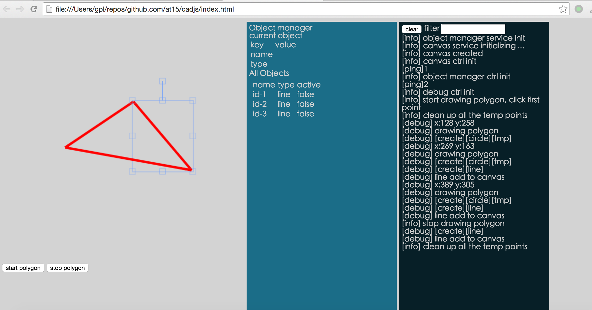

# cadjs

A 2d cad modeling application built on top of [fabric.js](http://fabricjs.com/) and 
angularjs using typescript

live demo http://at15.github.io/cadjs/ click start polygon on bottom left to start drawing and 
click stop polygon when you finish

## Features 

- wrap for fabric.js element and hack to get standard object to use in cad, like point, line
  and polygonß
- object manager service and ui control to track & modify objects
- debug service and ui control, log to screen in service and control.

## Stuff

- use fabirc.js for canvas handling
- use ts for strict typing

## screen shot

